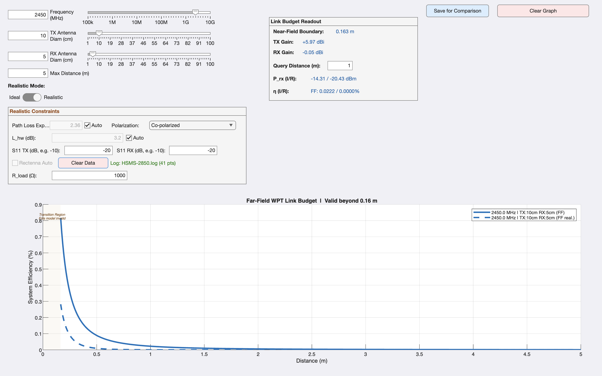
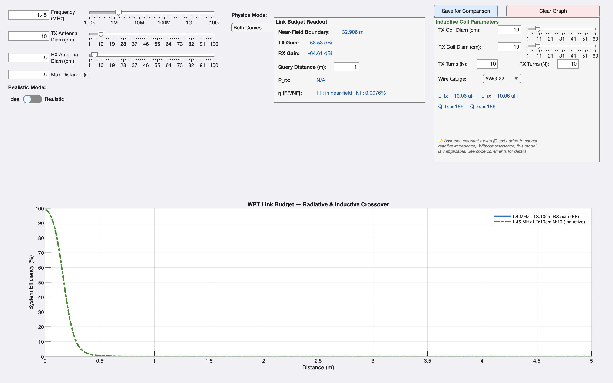

# WPT Link Budget Calculator

[](<https://www.mathworks.com/downloads/>)
[](<https://www.analog.com/en/resources/design-tools-and-calculators/ltspice-simulator.html>)
[](<https://www.usf.edu/engineering/>)

This repository contains a Wireless Power Transfer (WPT) Link Budget Calculator, designed as a comprehensive MATLAB application with accompanying core models and an LTspice simulation.

## Features

- **MATLAB App Interface**: An intuitive GUI (`App_ideal.m`) to calculate and visualize link budgets for WPT systems.
- **Far-Field and Near-Field Models**: Robust calculation models for both far-field (`wpt_farfield_model.m`) and near-field (`wpt_nearfield_model.m`) scenarios.
- **Friis Transmission Equation**: Core calculations implemented in `friis_core.m`.
- **LTspice Integration**: Includes an LTspice simulation file (`LTspice simulation.asc`) with MATLAB scripts (`parse_ltspice_log.m`) to analyze simulation logs.

## Repository Contents

- `App_ideal.m`: Main MATLAB application script. Run this to launch the GUI.
- `wpt_farfield_model.m` / `wpt_nearfield_model.m`: Core functions to compute the link budget for different ranges.
- `friis_core.m`: Implements the Friis transmission equation for power transfer estimations.
- `load_rectenna_curve.m`: Loads and processes rectenna performance curves.
- `wpt_heuristics.m`: Defines heuristics and optimizations for WPT link estimations.
- `verify_model.m`: Script for verifying and testing the different theoretical models against known values.
- `parse_ltspice_log.m`: Utility to parse data from LTspice simulation log files.
- `LTspice simulation.asc`: LTspice circuit schematic for simulating the power transfer setup.

## Examples

### Example 1: Far-Field Link Budget & Threshold Effects
In this example, we calculate the expected received power and efficiency in a typical far-field scenario. 
- **Operating Frequency:** 2.45 GHz (ISM band)
- **Distance:** 5 meters (Max)
- **Antennas:** 10 cm Tx diameter, 5 cm Rx diameter

By inputting these parameters, you can instantly visualize the spatial efficiency of the link. Here, we loaded a custom LTspice simulation log (`HSMS-2850.log`) to demonstrate the strict non-linear threshold effects of a real Schottky diode, causing the realistic efficiency (dashed line) to plunge to zero as the received power falls below the diode's turn-on voltage:



### Example 2: Deep Near-Field Inductive Transfer
This example focuses purely on near-field magnetic transfer efficiency.
- **Operating Frequency:** 1.45 MHz
- **Distance:** 5 meters (Max)
- **Antenna Coils:** 10 cm diameter circular coils (Tx/Rx) with 10 turns

Because the operating frequency is very low, the near-field boundary extends far beyond our 5-meter plot (calculated at ~32.9 meters). Therefore, the graph beautifully demonstrates pure inductive coupling without radiative interference. The efficiency is nearly 100% at point-blank range before rapidly decaying according to the strict geometric near-field power roll-off:



## Getting Started

1. Clone or download this repository to your local machine.
2. Open MATLAB and navigate to the repository directory.
3. Run `App_ideal.m` in the MATLAB Command Window to launch the WPT Link Budget Calculator App.
4. To run the circuit simulations, open `LTspice simulation.asc` in LTspice. You can use the generated logs in MATLAB via the `parse_ltspice_log.m` script.


## Research Roadmap

| Phase | Status | Description |
|---|---|---|
| MATLAB Physics Engine | ✅ Complete | Dual-regime far-field/near-field model, crossover detection, 14-test verification suite |
| LTspice Circuit Simulation | ✅ Complete | HSMS-2850 half-wave and voltage doubler characterization at 2.45 GHz |
| Hardware Fabrication | 🔜 Fall 2025 | HSMS-2850 rectenna PCBs, impedance matching network |
| Hardware Validation | 🔜 Fall 2025 | NanoVNA S₁₁ measurements, RTL-SDR power measurements vs. simulation |
| Multi-Frequency Comparison | 🔜 Planned | 915 MHz, 2.45 GHz, 5.8 GHz side-by-side efficiency characterization |
| Research Publication | 🔜 Planned | Formal crossover analysis paper |

## Acknowledgements

- **HSMS-2850 SPICE model parameters** — Broadcom / Avago Technologies, 
  Application Note AN1020
- **Modified Wheeler inductance formula** — Mohan, N. et al. (1999). 
  *Simple accurate expressions for planar spiral inductances*. 
  IEEE Journal of Solid-State Circuits
- **Friis transmission equation** — Friis, H.T. (1946). 
  *A note on a simple transmission formula*. 
  Proceedings of the IRE
- **Coupled-resonator efficiency formula** — Kurs, A. et al. (2007). 
  *Wireless power transfer via strongly coupled magnetic resonances*. 
  Science
```
